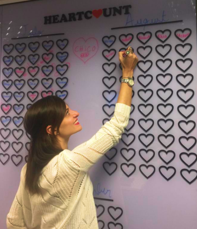
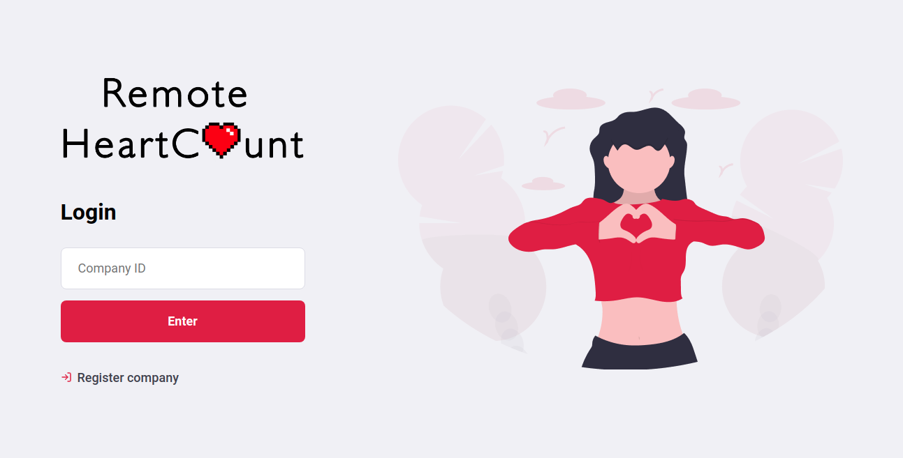
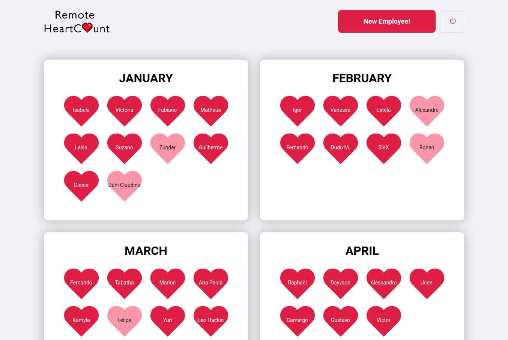
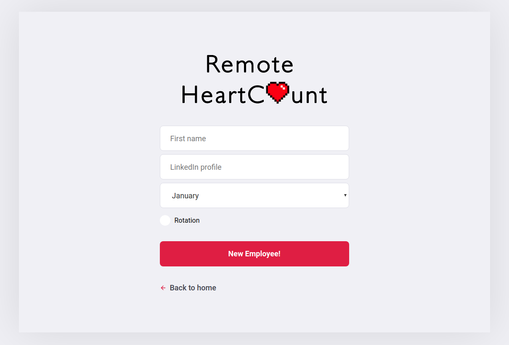

<h1 align="center">
   
</h1>

   

## What's HeartCount?

In the HR (Human Resources) world, the indicator headcount represents the number of employees in the company. In my team, we decided to name it **HeartCount**.
The **HeartCount** represents the number of hires/placements we do. We chose the word "heart" instead of "head", to reflect how much we care about our candidates ❤️

## The Problem

Every time we fill a vacancy, we write the names of our hires in the original HeartCount, located on the office walls. The issue is that our team is (now even more) distributed in several locations and only people who were based in our headquarters could use the physical HeartCount.

## The Solution

Then... we created a [**Remote HeartC❤️unt**](https://remoteheartcount.herokuapp.com/)!
Now every recruiter can celebrate their placements by writing their candidates´ names to our online HeartCount!

<h2 align="center">
   
</h2>

 

|                                 Home                                  |                                    New Employee                                     |
| :-------------------------------------------------------------------: | :---------------------------------------------------------------------------------: |
|  |  |

## How to use?

Enter [here](https://remoteheartcount.herokuapp.com/), register your company and have fun!

<h2 align="center">
   Contributions of any kind welcome!
</h2>

   

> _"If you don't understand people, you don't understand business" - Simon Sinek_
